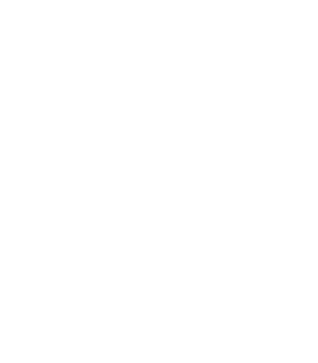
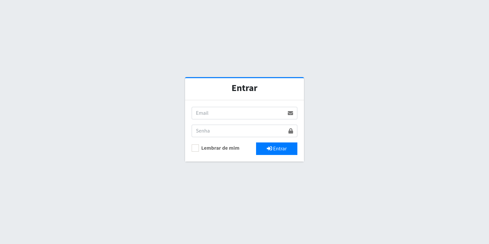

<p align="center">
    
</p>

<p align="center">
  🧪 Aplicação web desenvolvida para gerenciamento de laboratórios de informática da FATEC - JAHU
</p>



## :hammer_and_wrench: Tecnologias

- [Laravel](https://laravel.com/)
- [Laravel Mix](https://laravel.com/docs/8.x/mix)
- [AdminLTE](https://adminlte.io/)
- [DataTables](https://datatables.net/)
- [Docker](https://www.docker.com/)
- [MySQL](https://www.mysql.com/)


## :gear: Como rodar a aplicação

**:hammer_and_wrench: Tecnologias necessárias**

- PHP - Preferencialmente a versão 7.4
- NodeJS - Preferencialmente a versão 14.x.x
- Docker
- Docker Compose

```bash
# Clone este repositório
$ git clone <git@github.com:gaoliveira21/lab-maintenance.git>

# Acesse a pasta do projeto no terminal/cmd
$ cd lab-maintenance

# Crie um arquivo .env seguindo como modelo o arquivo .env.example
$ cp .env.example .env

# Gere a chave para executar a api
$ php artisan key:generate

# Instale as dependências
$ npm install
$ composer install

# Inicie o container
$ docker-compose up -d

# Execute as migrations
# Por padrão será adicionado um usuário ao banco de dados, não se esqueça de preencher as seguintes variáveis de ambiente para não ter problemas:
# ADMIN_NAME | ADMIN_EMAIL | ADMIN_PASSWORD
$ php artisan migrate

# Rode as seeds
$ php artisan db:seed

# Execute a API
$ php artisan serve

# Execute o laravelmix em modo de desenvolvimento
$ npm run dev

# O servidor inciará na porta:8000 - acesse <http://localhost:8000>
```

### :construction_worker: Feito por:

<table>
  <tr>
    <td align="center"><a href="https://github.com/gaoliveira21"><br /><sub><b>Gabriel Oliveira</b></sub></a><br /></td>
  </tr>
</table>

**Contato:** <a href="https://www.linkedin.com/in/gabriel-jos%C3%A9-de-oliveira-633962197/">Linkedin</a>
